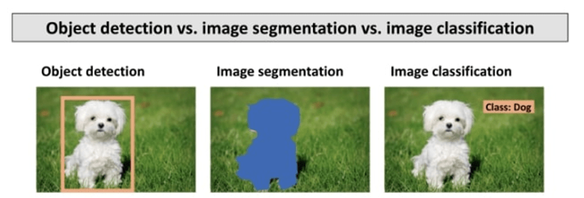
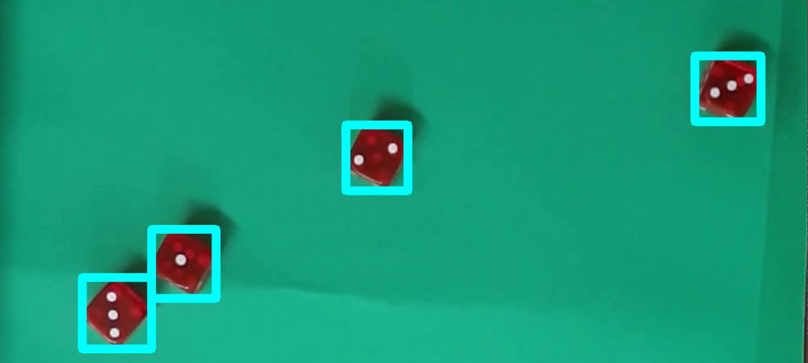
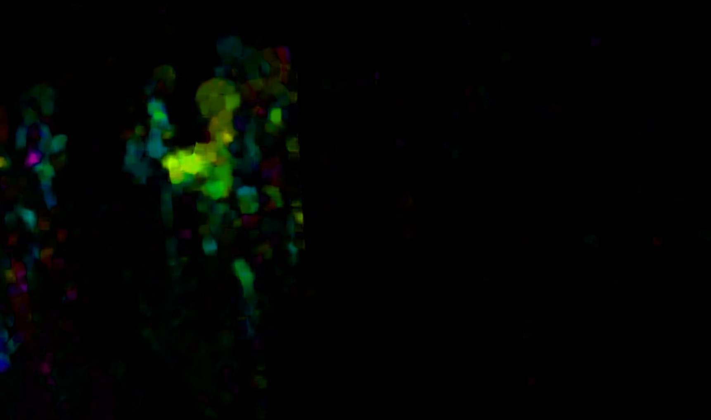
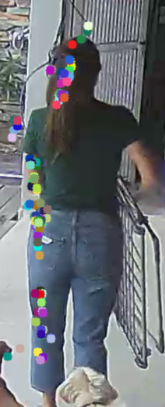

# 2 - Explique cuál es diferencia entre localización de objetos y clasificación de imágenes. Muestre ejemplos de ello.
---

* 
<b><u>Clasificación de Imágenes</b></u>:

La clasificación de imágenes se enfoca en etiquetar una imagen con una categoría predefinida.
En otras palabras, se trata de decidir qué objeto o concepto está presente en la imagen.

<b>Ejemplo</b>: Si vemos una foto de un animal, la clasificación nos diría que es una imagen de un perro o un gato.

* 
<b><u>Localización de Objetos</b></u>:

La localización de objetos indica dónde se encuentra el objeto en la imagen.
Imagina que tenemos una foto con varios objetos (por ejemplo, personas, coches y edificios).
La localización de objetos construye coordenadas para cada objeto o region de interés (ROI).
ROI delimitadoras ayudan a la máquina a reconocer y ubicar cada objeto específico.

<b>Ejemplo</b>: En una imagen de una ciudad, varias regiones de interes, por ejemplo autos y personas. 

Las aplicaciones de detección de objetos son amplias e incluyen seguimiento de personas/objetos y cámaras de videovigilancia.
En resumen, la clasificación nos dice qué hay en la imagen, mientras que la localización nos dice dónde está cada objeto específico. Ambas son esenciales en el campo de la visión por computadora y el aprendizaje profundo
